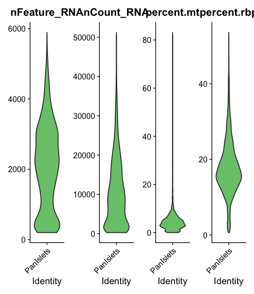
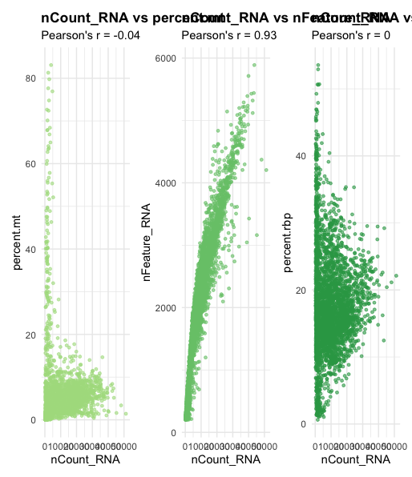
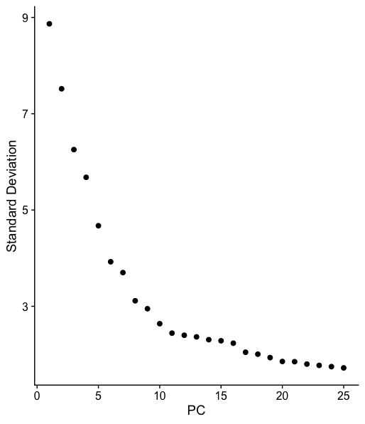
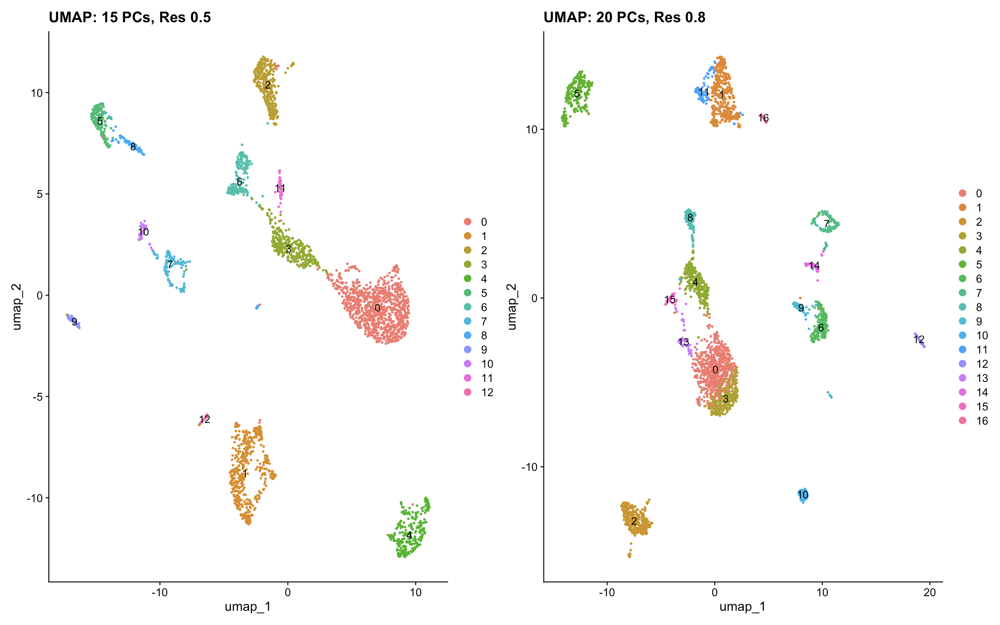
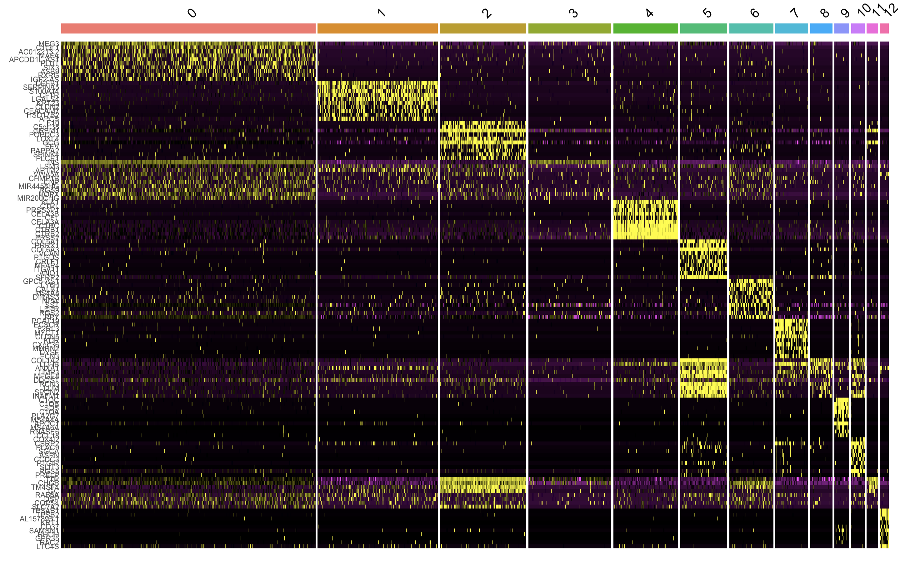
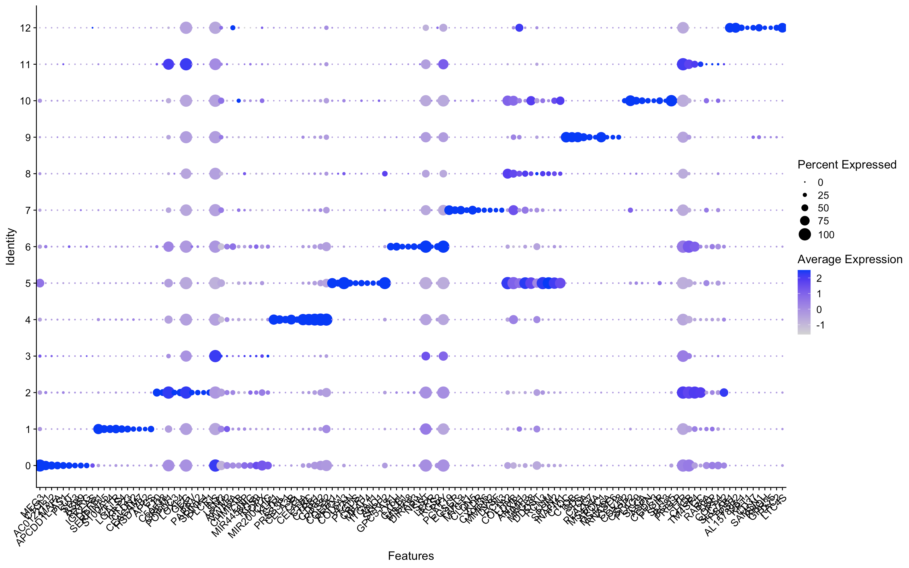
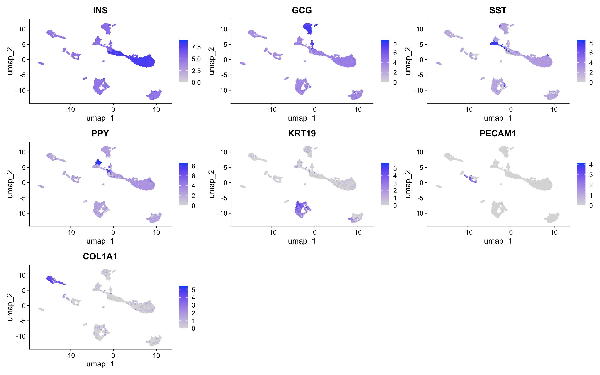
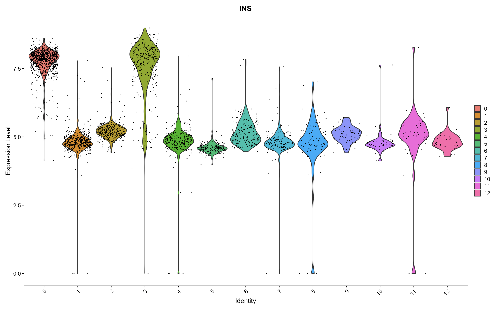
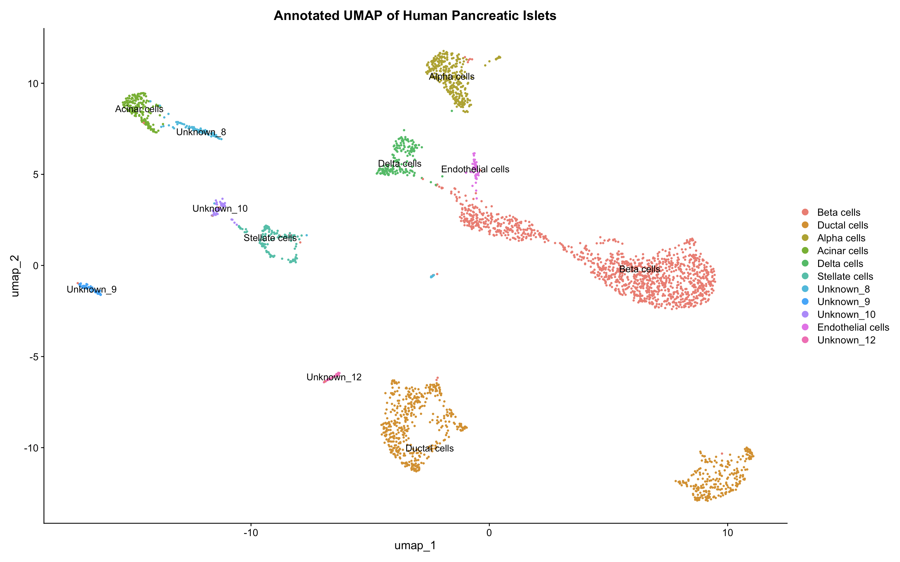

# Human Pancreatic Islets Single-Cell RNA-Seq Analysis


## 📌 Project Overview
This project presents an end-to-end single-cell RNA sequencing (scRNA-seq) analysis pipeline executed on human pancreatic islet dataset using R and the **Seurat** framework. 

The goal of this study is to profile cell heterogeneity within human pancreatic islets, separate endocrinal and non-endocrinal cell types, identify cell-type-specific marker genes, and assign biological identities to distinct single-cell clusters.

---

## 🛠️ Computational Pipeline

The analysis was structured into 7 distinct phases to ensure methodological rigor and reproducibility:

1. **Data Loading & Preprocessing**: Importing sparse gene expression matrices into Seurat objects.
2. **Quality Control (QC) & Filtering**: Removal of low-quality cells, doublets, and damaged cells using mitochondrial gene expression thresholds (`percent.mt`) and UMI counts (`nFeature_RNA`, `nCount_RNA`).
3. **Normalization & Feature Selection**: Data normalization using `LogNormalize` and identification of top highly variable features (HVGs).
4. **Dimensionality Reduction (PCA)**: Principal Component Analysis, evaluation of cell-cycle phase influences (G1, S, G2M), and determination of significant PCs using Elbow Plotting.
5. **Clustering & Parameter Optimization**: Benchmarking multiple parameter settings (15 PCs at Res 0.5 vs. 20 PCs at Res 0.8) to prevent over-clustering.
6. **Marker Gene Discovery**: Identification of differentially expressed genes (DEGs) per cluster using non-parametric Wilcoxon rank-sum tests (`FindAllMarkers`).
7. **Cell Type Annotation**: Mapping identified markers to established pancreatic lineage markers to annotate clusters.

---

## 📊 Key Results & Visualizations

### 1. Quality Control & Filtering
Filtering out damaged cells and high-mitochondrial noise ensured clean transcriptomic profiles downstream.

 


### 2. PCA & Dimension Selection
The Elbow Plot indicated that the majority of biological variation is captured within the first 15 Principal Components.


### 3. Clustering Benchmark
Comparing two parameter settings demonstrated that **15 PCs with Resolution 0.5** provided a biologically sound balance compared to over-clustered alternatives:


### 4. Marker Gene Expression & Profiling
Cluster marker specificity was confirmed using multi-gene heatmaps and dot plots:



### 5. Biological Validation with Canonical Markers
Canonical markers were evaluated across all clusters:
- **`INS`** (Beta cells)
- **`GCG`** (Alpha cells)
- **`SST`** (Delta cells)
- **`KRT19`** (Ductal cells)
- **`PECAM1`** (Endothelial cells)
- **`COL1A1`** (Stellate / Stromal cells)




### 6. Final Cell Type Annotation
The final UMAP map delineates all major endocrinal and stromal cell populations present in the tissue sample:


---

## 💻 Dependencies & Requirements

To run this pipeline, install the following R packages:

```r
install.packages(c("Seurat", "dplyr", "ggplot2", "patchwork"))